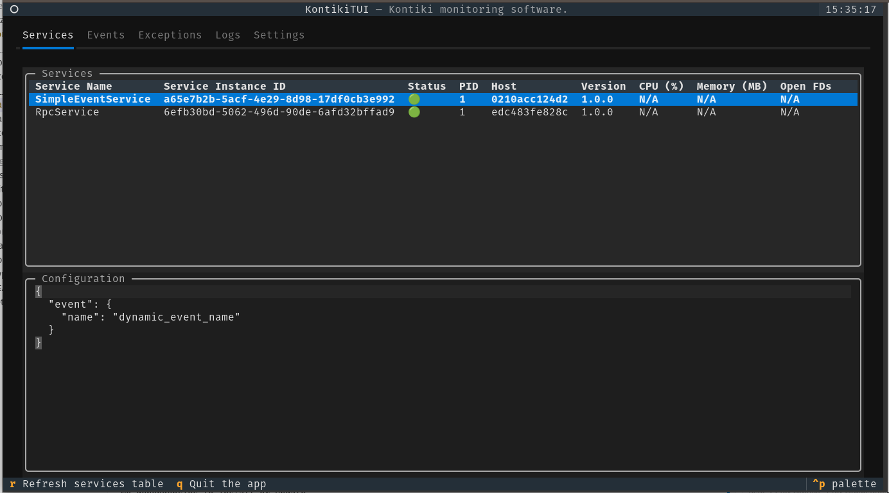
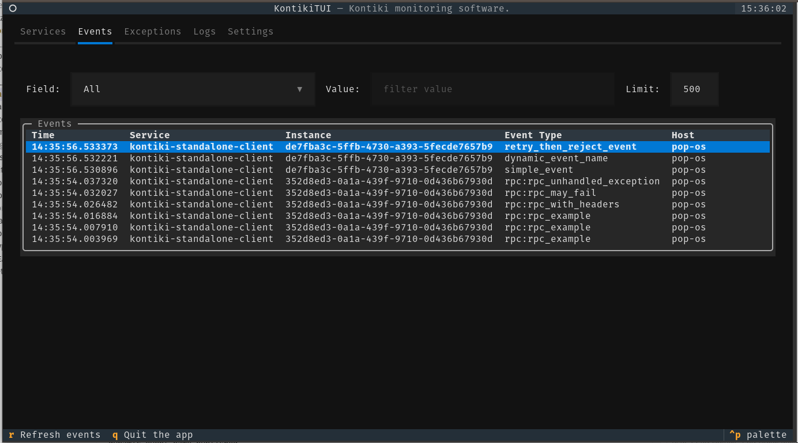
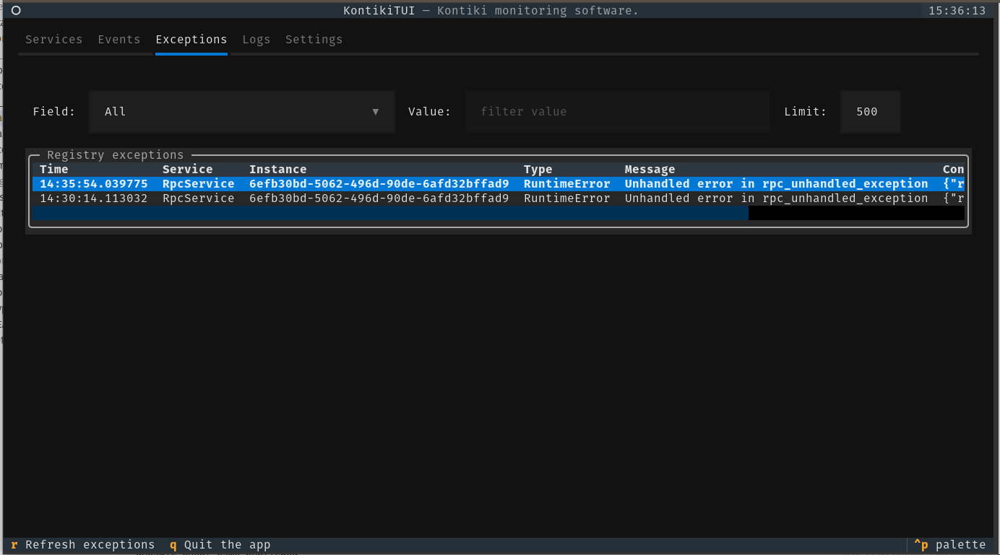
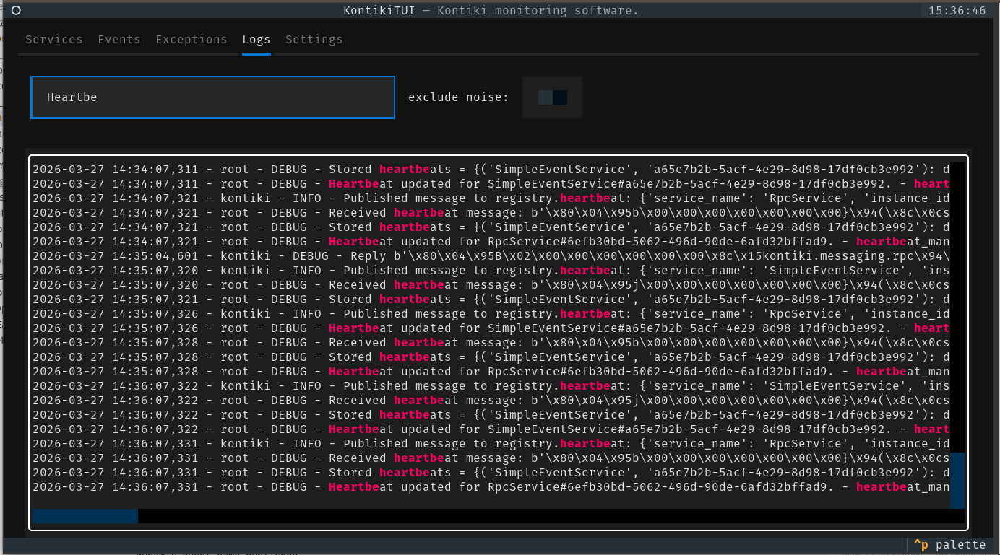
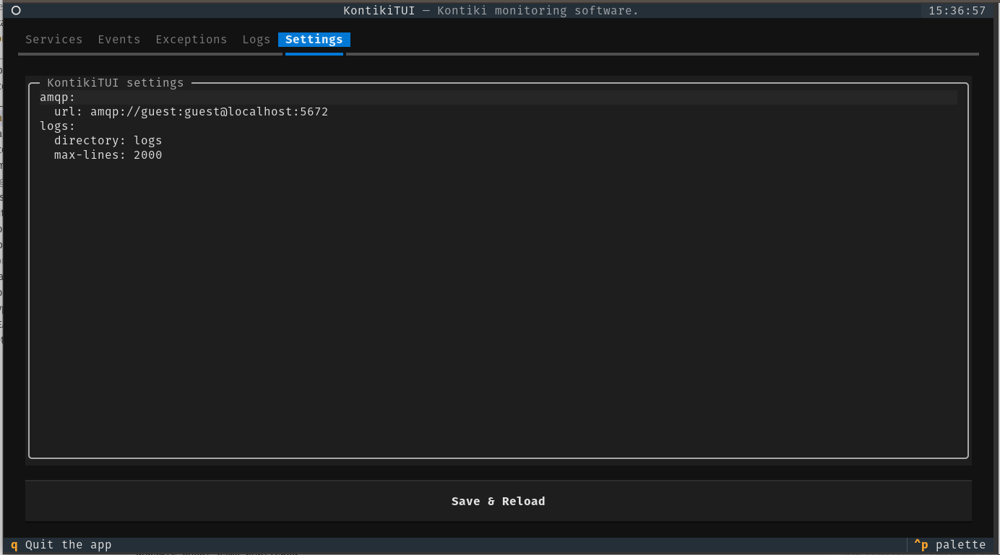

# KontikiTUI

## Overview

**KontikiTUI** is a small terminal UI for monitoring [Kontiki](https://github.com/kontiki-org/kontiki)
systems via the Kontiki service registry and log files.

It is built with [Textual](https://textual.textualize.io/), a Python TUI framework.

It is “engineering‑tool” oriented:

- quick view of **running services** (status, pid/host, version, local stats when possible),
- inspect **events** and **exceptions** recorded by the registry,
- read **logs** without leaving the terminal.

---

## Tabs

- **Services**: registered services with `status`, `pid/host`, `version` and local stats
  (CPU/MEM/FD when possible, otherwise `N/A`). Selecting a row shows the configuration/metadata in JSON.

  

- **Events**: events tracked by the registry, with local filters (`Field`/`Value`/`Limit`).
  RPC-like events are displayed as `rpc:<remote_method>` when `event_type` is empty.

  

- **Exceptions**: exceptions from the registry exception tracker, with the same local filtering approach.
  The `context` payload is shown compactly.

  

- **Logs**: reads configured log files from `logs.directory` and displays them in the UI.
  Uses `lnav` when available; otherwise it falls back to a Python reader.

  

- **Settings**: edit `~/.config/kontiki_tui.yaml` (the app reloads configuration on save).

  

---

## Requirements

- **Optional**: [lnav](https://lnav.org/) for richer log filtering; without it, a built-in Python reader is used

## Quickstart

### Install & run

```bash
make install
make run
```

### Test stack (RabbitMQ + registry + example services)

In one terminal:

```bash
make stack-up
```

In another terminal:

```bash
make run
```

Launch examples to view events and exceptions
```
make run-rpc-example
make run-simple-event-example
```

To stop:

```bash
make stack-down
```

## Contributing

See [CONTRIBUTING.md](CONTRIBUTING.md).

## License

Licensed under the Apache License, Version 2.0. See [LICENSE](LICENSE) and [NOTICE](NOTICE).
