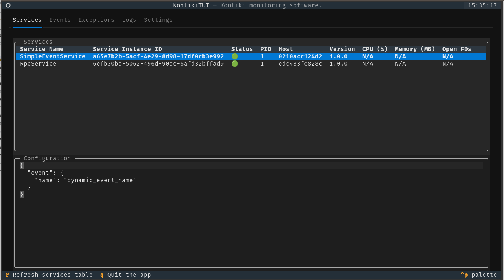
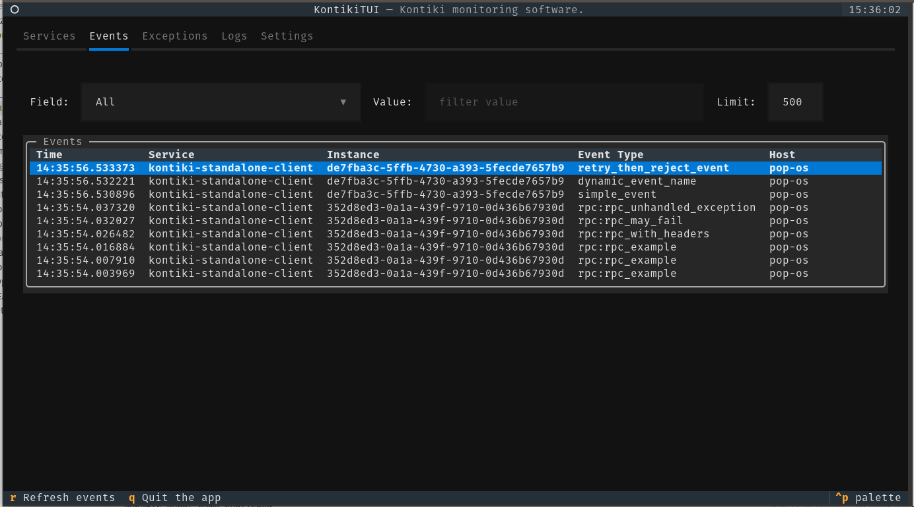
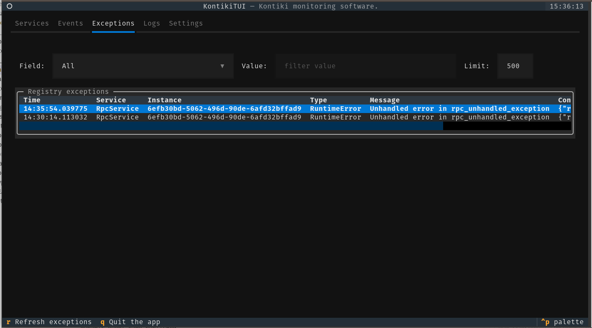
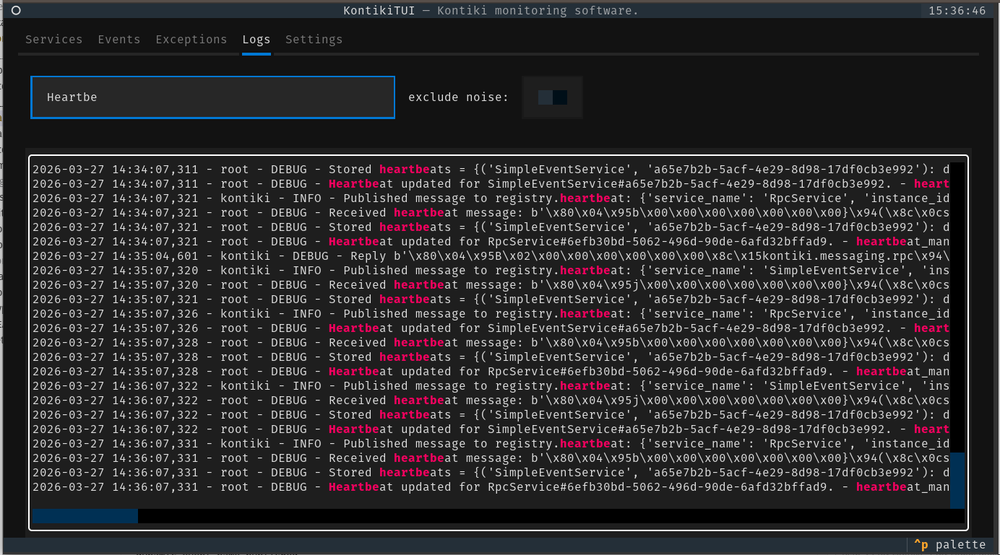
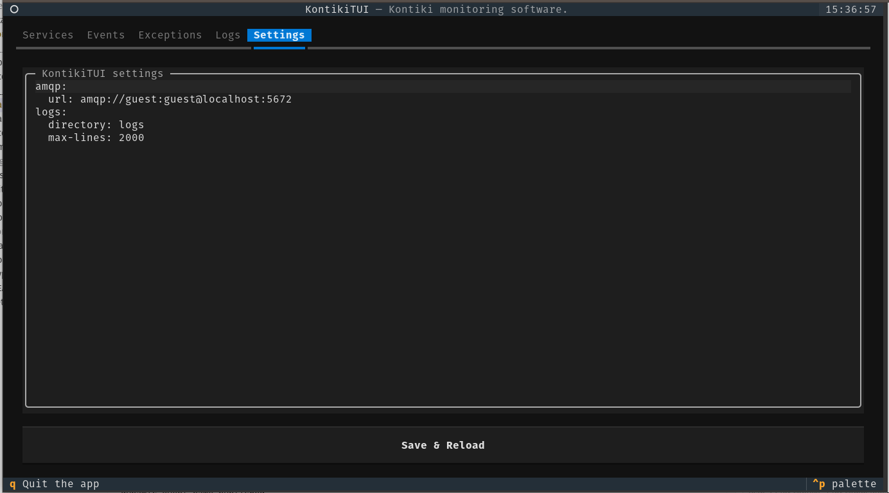

# KontikiTUI

> **Part of the Kontiki suite** — a compact open-source stack for startups and
> small teams that need ops without the heavy stack.
>
> Full suite overview → https://kontiki-org.github.io/
>
> Ops demo → [kontiki-monitor Quickstart](https://github.com/kontiki-org/kontiki-monitor#quickstart--demo-app--telegram).


## Overview

**KontikiTUI** is a small terminal UI for monitoring [Kontiki](https://github.com/kontiki-org/kontiki)
systems via the Kontiki service registry and log files.

It is built with [Textual](https://textual.textualize.io/), a Python TUI framework.

It is “engineering‑tool” oriented:

- quick view of **running services** (status, last heartbeat, degraded reason, host/pid, service and Kontiki versions),
- inspect **events** and **exceptions** recorded by the registry,
- read **logs** without leaving the terminal.

The Header subtitle is the installed KontikiTUI version.

---

## Tabs

- **Services**: registered services with status, last heartbeat, degraded reason,
  host/pid, service version, and Kontiki runtime version (`kontiki_version` on
  `get_services`; empty when the instance does not report it; Kontiki ≥1.10.0).
  Selecting a row shows the configuration/metadata in JSON. Local filters
  (`Field`/`Value`) match service name, instance id, status, host, service
  version, or Kontiki version.

  Mute column (`🔇`) reflects kontiki-monitor silences (`service_name`). `s`
  toggles the selected service; `S` mutes or unmutes all live names in the
  current Group (always confirmed). Activating the tab warns if silenced
  names are no longer in the registry (`WarningPrompt`).

  Defaults to **all** via the session **Group** Select on each monitoring tab.
  Options are `all` plus groups discovered in the live registry. Changing it in
  one tab updates all tabs. Missing/blank Registry `group` counts as business.
  Instance column shows the Kontiki short id (12 hex), not the full UUID.

  

- **Incidents**: open ops alerts (`list_open_alerts`) from `kontiki-monitor`
  (fleet / exception fingerprints) and every live `host-check-service` instance
  (disk). Session Group Select and local `Field`/`Value` filters. Selecting a
  row shows the full alert JSON. Mute does not cover host-check disk alerts.
  Requires Kontiki ≥1.13.0 and `boomerang-contracts` (pickled `NormalizedAlert`).

- **Silences**: monitor silences (`list_silences`), including names missing from
  the registry. `s` clears the selected silence. Session Group Select: absent
  names show as `business`. Mute is still posed from Services.

- **Events**: events tracked by the registry, with local filters (`Field`/`Value`/`Limit`).
  Domain publishes and RPC calls are shown (`rpc:<remote_method>` when there is no
  `event_type`). Hides registry bookkeeping and TUI observer traffic.
  Filtered by the same session Group Select (registry jointure).
  Deregistered instances fall back to `business`.

  

- **Exceptions**: exceptions from the registry exception tracker, with the same local filtering approach.
  Also filtered by the session Group Select. The `context` payload is shown compactly.

  

- **Logs**: reads log files of instances currently in the registry, from
  `logs.directory`. Uses `lnav` when available; otherwise a Python reader.
  Files follow Kontiki ≥1.8.1 naming `{service_name}-{short_instance_id}.log`
  and the session Group Select. Leftover files from deregistered instances,
  `ServiceRegistry-*.log`, and non-Kontiki filenames are not opened.

  

- **Settings**: edit `~/.config/kontiki_tui.yaml` (the app reloads configuration on save).

  

---

## Requirements

- **Optional**: [lnav](https://lnav.org/) for richer log filtering; without it, a built-in Python reader is used

## Quickstart

### Install from PyPI

```bash
pip install kontiki-tui
kontiki-tui
```

([package on PyPI](https://pypi.org/project/kontiki-tui/))

### Install from source (Poetry)

```bash
make install
make run
```

### Test stack (RabbitMQ + registry + example services)

In one terminal:

```bash
make stack-up
```

In another terminal:

```bash
make run
```

Launch examples to view events and exceptions
```
make run-rpc-example
make run-simple-event-example
```

To stop:

```bash
make stack-down
```

## Contributing

See [CONTRIBUTING.md](CONTRIBUTING.md).

## License

Licensed under the Apache License, Version 2.0. See [LICENSE](LICENSE) and [NOTICE](NOTICE).
