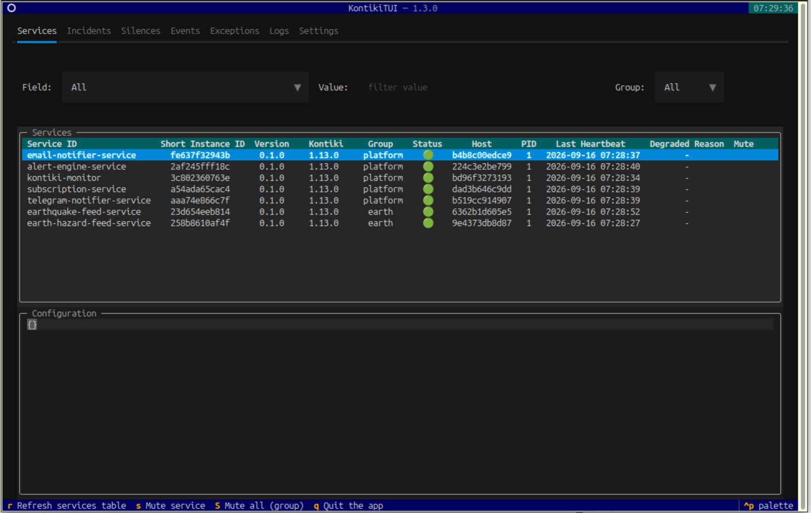
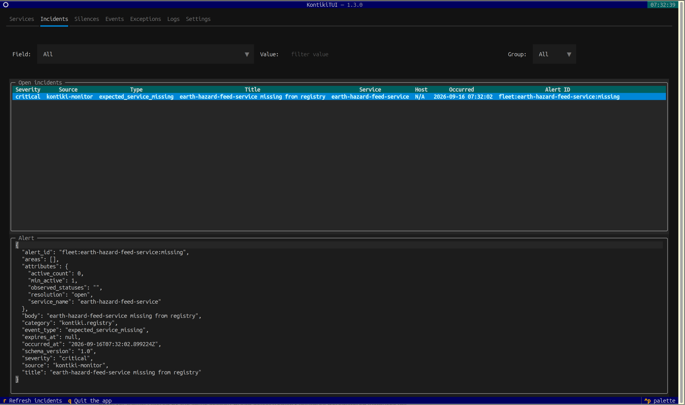
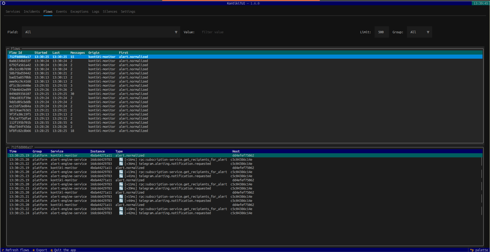
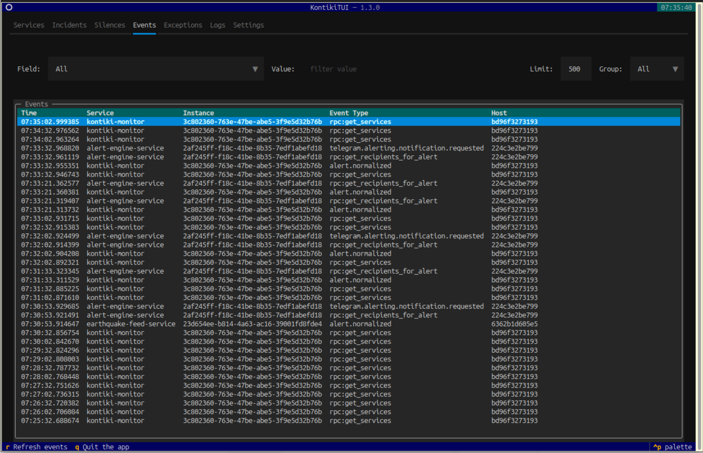
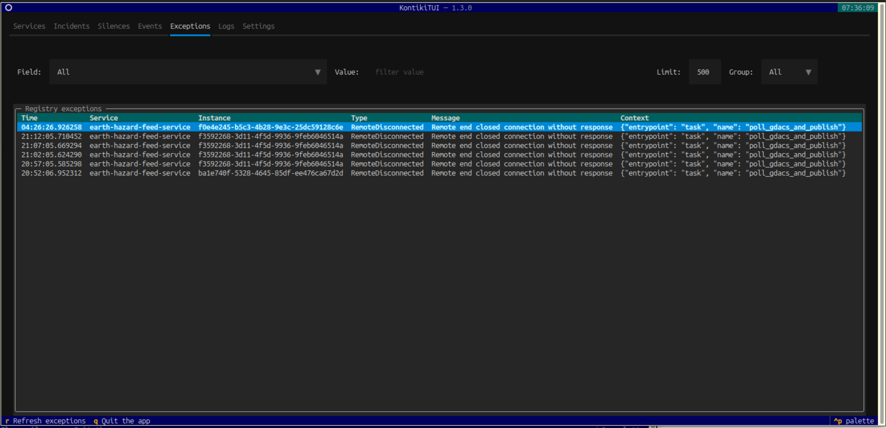
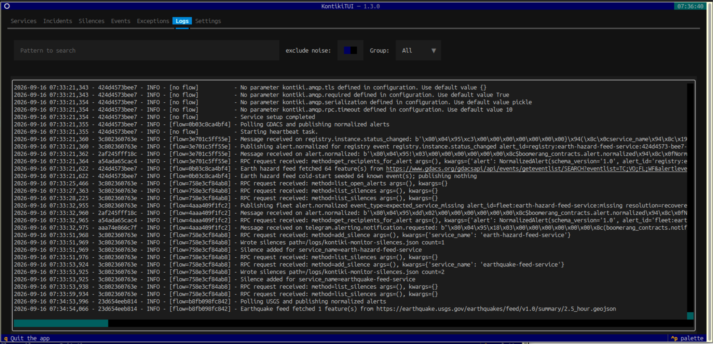
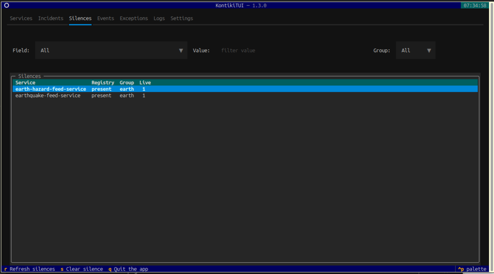
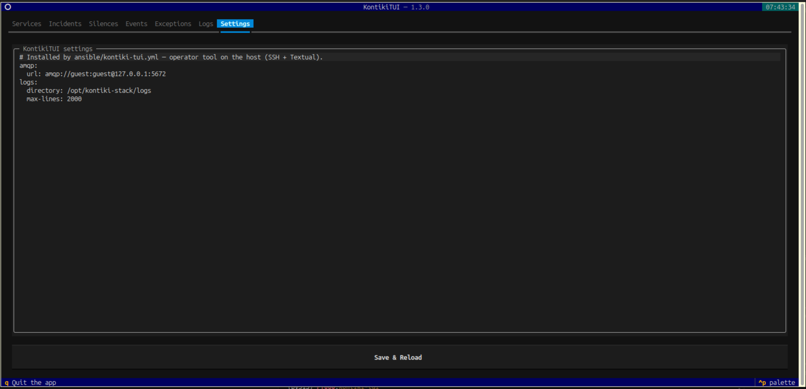

# KontikiTUI

> **Part of the Kontiki suite** — Python runtime, registry, terminal UI, and
> fleet monitoring for distributed services.
>
> Full suite overview → https://kontiki-org.github.io/
>
> Ops demo → [kontiki-monitor Quickstart](https://github.com/kontiki-org/kontiki-monitor#quickstart--demo-app--telegram).


## Overview

**KontikiTUI** is a terminal UI for a [Kontiki](https://github.com/kontiki-org/kontiki)
fleet: one SSH entry point for registry census, open ops alerts, flow trees,
events, exceptions, logs, and silences.

It is built with [Textual](https://textual.textualize.io/). A session **Group**
Select slices every monitoring tab the same way (`all` plus groups discovered
in the registry).

---

## Tabs

Every monitoring tab uses the same session **Group** Select (`all` plus
groups from the live registry). Changing it in one tab updates all tabs.
Instance ids are the Kontiki 12-hex short id. `r` refreshes the active tab.

- **Services**: live instances (status, heartbeat, host/pid, versions).
  Row → public config JSON. `s` / `S` mute via kontiki-monitor (confirmed).

- **Entrypoints**: catalogue a service exposes (events, RPC, HTTP, tasks)
  and retained competing messages. `p` replays the oldest one, `d` drops it
  (both confirmed). Requires Kontiki ≥2.2.0.

  

- **Incidents**: open alerts from `kontiki-monitor` and `host-check-service`.
  Row → alert JSON. `e` exports Markdown.

  

- **Flows**: AMQP chains by `flow_id` (list + message tree). Exceptions nest
  under the hop that failed. Context records (Kontiki 2.0) are annotations
  on the tree, not hops. `e` exports the tree and matching log lines
  (`[flow=…]`, including traceback). Requires Kontiki ≥2.0.0.

  

- **Events**: publishes and RPC calls in time order. Hides
  `registry.context.recorded` (Flow annotations, Kontiki 2.0).

  

- **Exceptions**: registry exception index. Tracebacks stay in Logs.
  `e` exports Markdown.

  

- **Logs**: current instance log files under `logs.directory` (`lnav` if
  installed). Group Select applies.

  

- **Silences**: monitor mutes, including names no longer registered.
  `s` clears the selected row. Mute is set from Services.

  

- **Settings**: `~/.config/kontiki_tui.yaml` (reload on save).
  Markdown exports go to `export.directory` (`e` then `y`).

  

---

## Requirements

- Kontiki 2.2.0
- RabbitMQ ≥ 4.3
- **Optional**: [lnav](https://lnav.org/) for richer log filtering; without it, a built-in Python reader is used

## Quickstart

### Install from PyPI

```bash
pip install kontiki-tui
kontiki-tui
```

([package on PyPI](https://pypi.org/project/kontiki-tui/))

### Install from source (Poetry)

```bash
make install
make run
```

### Test stack (RabbitMQ + registry + example services + kontiki-monitor)

In one terminal:

```bash
make stack-up
```

In another terminal:

```bash
make run
```

Launch examples to view events and exceptions
```
make run-rpc-example
make run-simple-event-example
```

To stop:

```bash
make stack-down
```

## Contributing

See [CONTRIBUTING.md](CONTRIBUTING.md).

## License

Licensed under the Apache License, Version 2.0. See [LICENSE](LICENSE) and [NOTICE](NOTICE).
